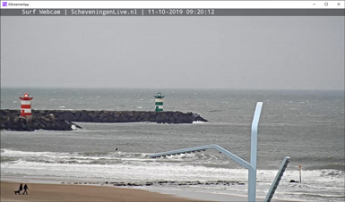

# fuse-gstreamer

[](https://ci.appveyor.com/project/mortend/fuse-gstreamer/branch/master)
[](https://www.npmjs.com/package/fuse-gstreamer)
[](https://slackcommunity.fusetools.com/)
[](LICENSE)


[GStreamer] package for [Fuse Open].

> GStreamer supports a wide variety of media-handling components, including simple audio playback, audio and video playback, recording, streaming and editing. The pipeline design serves as a base to create many types of multimedia applications such as video editors, transcoders, streaming media broadcasters and media players.

[GStreamer]: https://gstreamer.freedesktop.org/
[Fuse Open]: https://fuseopen.com/

## Install

```shell
$ npm install fuse-gstreamer
```

This will install the `GStreamer` library for [Fuse SDK](https://www.npmjs.com/package/fuse-sdk).

### Requirements

GStreamer development and runtime files for desired platforms must be installed on your system to use this package. More information can be found on [this page](https://gstreamer.freedesktop.org/download/).

> On Android, dependencies are downloaded automatically when building. You don't need to install anything manually.

> On Windows, make sure to install the MinGW 64-bit edition, and verify that `GSTREAMER_1_0_ROOT_X86_64` is set in your environment (to for example `C:\gstreamer\1.0\x86_64\`).

> Tested using GStreamer **v1.16.0** (although any recent version should work fine).

## Usage

```xml
<App xmlns:gst="GStreamer.Controls">
    <gst:Player Uri="rtsp://b1.dnsdojo.com:1935/live/sys3.stream" />
</App>
```

This instantiates a GStreamer control playing a live video stream over RTSP. Many common transport protocols, container formats and media codecs are supported out-of-the-box. If you want to play local files, provide a `file:///` URI instead.

> To use this control in your project, you must add `"GStreamer"` to `"Packages"` in your `.unoproj` file.

### Example app



> You can play around with the included [example app](https://github.com/mortend/fuse-gstreamer/tree/master/example).

First, make sure dependencies are installed and our library is built.

```shell
npm install
npm run build
```

Then, issue one of the following commands to run the app on your desired platform.

```shell
npm run android
npm run ios
npm run native
```

### Custom pipelines

Essentially, make sure to initialize GStreamer in Uno, then write GStreamer code to do what you want... ;-)

```uno
GStreamer.Init();
```

> Check out the files under [`GStreamer/`](GStreamer/) to see how GStreamer is used from Uno, most notably [`UriPipeline.uno`](GStreamer/UriPipeline.uno).

> Check out [`Player.uno`](GStreamer.Controls/Player.uno) to see how this stuff is wrapped up into the UX control we're using in our example app.

> If you add some cool functionality, remember that pull requests are very welcome. :-)

## Contributing

Please [report an issue](https://github.com/mortend/fuse-gstreamer/issues) if you encounter a problem, or [open a pull request](https://github.com/mortend/fuse-gstreamer/pulls) if you make a patch.

## License

MIT for code in this repository, but note that GStreamer is LGPL and that some plugins may require additional licenses.
